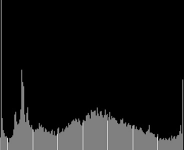

# Demonstrations

## Color channels

```@raw html
<div class="cards">
```

```@raw html
<div class="card-200">
<div class="card-img">
```
[](@ref color_separations_svd)

```@raw html
</div>
<div class="card-text">
```
[Color separations and SVD](@ref color_separations_svd)
```@raw html
</div>
</div>

```

```@raw html
<div class="card-200">
<div class="card-img">
```
[](@ref contrast_brightness_histogram)

```@raw html
</div>
<div class="card-text">
```
[Contrast and Brightness histograms](@ref contrast_brightness_histogram)
```@raw html
</div>
</div>

```

```@raw html
</div>
```


## Contributions

Users are invited to [contribute demonstrations of their own](https://github.com/JuliaImages/juliaimages.github.io).
