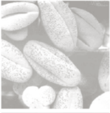
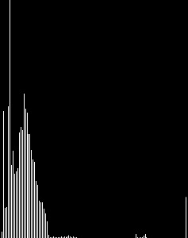
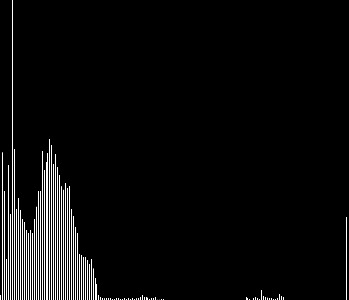
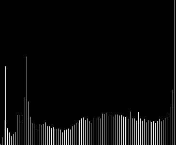

# [Contrast and brightness analysis using histograms] (@id contrast_brightness_histogram)

This demonstration will give you an idea on how to analyse and enhance the contrast and brightness of any image. We are using (Number of pixels vs. Pixel intensity) histogram of an 
image.
For this demo you can download the images from [here](https://drive.google.com/open?id=1xoqiDgO3FCHqzKFaL0TOa45GiBgzuwbU).

Ofcourse, a dark image and a bright image are visually different. 
But, here, to appreciate the difference we will draw their respective histograms and observe the characterstics.
For example consider the below images -

``` julia
using Images, ImageView, FileIO

darkImg = load("histogramEq/darkimage.png")
brightImg = load("histogramEq/lightimage.png")

imshow(darkImg)
imshow(brightImg)
```
**Note : In case of error, try importing ImageMagick library before Images library.**

|  |  |
|:------:|:---:|
| Dark | Bright |
Also, there can be some instances when we need a seperation mechanism for high 
contrast image and a low contrast image in a code.

``` julia
using Images, ImageView, FileIO

highConImg = load("histogramEq/highcontrast.png")
lowConImg = load("histogramEq/lowcontrast.png")

imshow(highConImg)
imshow(lowConImg)
```

|  |  |
|:------:|:---:|
| High Contrast | Low Contrast |
Analysing histograms may help in such seperations also.


Let's have a look at the histograms of these images - 
```julia
function plotHist(image)
    
    hist = imhist(image)
    
    column = maximum(hist[2])
    row = length(hist[1]) + 1
    img = fill(0, (column, row))
    
    j = 0
    for i in hist[2]
        for k in size(img)[1]- i + 1:size(img)[1]
            img[k, j] = 1
        end
        j = j + 1
    end
    return img
end

# to plot the histogram for dark image
img = plotHist(darkImg)
img = Gray.(img)
imshow(img)
```

|  |  |
|:------:|:---:|
| High contrast | Low contrast |

So, it may be noted from above that high contrast images have **roughly**
two distinct peaks in their histogram i.e., the foreground and 
background can be said to be concentrated around two different intensities. More distinct 
the peaks are more is the image contrast.
 
|  |  |
|:------:|:---:|
| Dark image | Bright image |
Also, on observing the histograms for bright and dark image, we observe that
in the case of bright images the intensity is **roughly** concentrated in the high intensity region. 
While, in the case of a dark image, the intensity is **roughly** concentrated in the low intensity region.

Histograms can be very useful in many applications. One such use is described below. 
We can enhance a low contrast image by using **Histogram Equalisation** method.
This method spreads out the most frequent intensity values in an image. 

``` julia
# equalising the low contrast image
equalised_img = histeq(lowConImg, 256) # 256 is the number of bins
imshow(equalised_img)
```
|  |
|:------:|
| Enhanced image |


 


