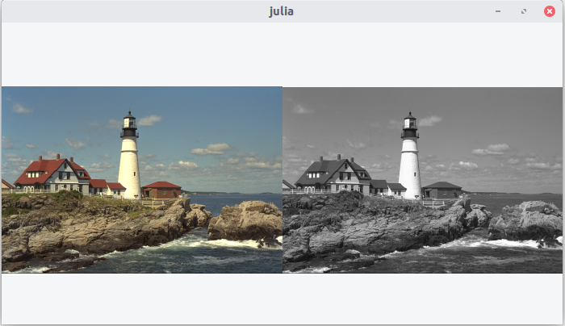

# [RGB to grayscale](@id rgb_to_grayscale)

This example converts an image with RGB channels into an image with a single grayscale channel.

```julia
using ImageView, Colors, TestImages, Gtk.ShortNames

original = testimage("lighthouse")
grayscale = Gray.(original)

grid, frames, canvases = canvasgrid((1,2))
imshow(canvases[1,1], original)
imshow(canvases[1,2], grayscale)
win = Window(grid)
Gtk.showall(win)
```
Here's the result


