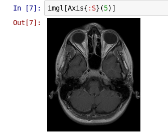

# Arrays: more advanced indexing

In addition to the handling of numbers and colors, one of the main
ways that JuliaImages leverages Julia is through a number of more
sophisticated indexing operations. These are perhaps best illustrated
with examples.

## Keeping track of location with unconventional indices

(**Note: this depends on the not-yet-integrated ImageTransformations.jl**)

Consider the following pair of images:

 

You might guess that the one on the right is a rotated version of the
one on the left. But, what is the angle? Is there also a translation?

One of the simplest ways to test this is to simply rotate the image on
the right until it seems aligned with the one on the left. We could
overlay the two images
([Using colorview to make color overlays](@ref)) to see how well we're
doing.

```julia
# Define the transformation, using CoordinateTransformations
julia> tfm = recenter(RotMatrix(pi/8), center(img))
AffineMap([0.92388 -0.382683; 0.382683 0.92388], [88.7786,-59.3199])

# Apply it to the image
julia> imgrot = warp(img, tfm);

julia> summary(imgrot)
"OffsetArrays.OffsetArray{ColorTypes.Gray{Float64},2,Array{ColorTypes.Gray{Float64},2}} with indices -59:446×-59:446"
```

Note particularly the indices of the output array, which the summary
line reports as "-59:446×-59:446."  This means that the first element
of imgrot is indexed with `imgrot[-59,-59]`---i.e., not starting with 1.

Why are these the returned indices? Displaying the rotated
image---overlaid on the original---reveals why:

```julia
# Create a padded version of the original with the same indices as imgrot
julia> img0 = similar(imgrot);

julia> fill!(img0, 0);

# Copy the data into the same index location
julia> img0[1:386, 1:386] = img;  # or write as img0[indices(img)...] = img

# Create the overlay
julia> imgov = colorview(RGB, img0, imgrot, zeroarray)
```


The padding on all sides of the array leaves space for the fact that
the rotated image (green) contains some pixels out of the region
contained within the original image (red).  The fact that Julia allows
these indices to be *negative* means that we have no trouble aligning
the original and rotated images: we just copy to the corresponding
location.

We can test whether this rotation aligns well with the original
unrotated image at the top of this page:

```julia
julia> img0[indices(imgref)...] = imgref;

julia> imgov = colorview(RGB, img0, imgrot, zeroarray);
```


The fact that the overlapping portion looks yellow---the combination
of red and green---indicates that we have perfect alignment.

You can learn more about julia's non-1 indexing at ??. (**to be written**)

## Keeping track of orientation with named axes

Suppose you are presented with a 3-dimensional grayscale image. Is this a movie (2d over time), or a 3d image (x, y, and z)? In such situations, one of the best ways to keep yourself oriented is by naming the axes.

```julia
julia> using Images, TestImages

julia> img = testimage("mri");

julia> imgl = AxisArray(img, :A, :R, :S)
3-dimensional AxisArray{ColorTypes.Gray{FixedPointNumbers.UFixed{UInt8,8}},3,...} with axes:
    :A, Base.OneTo(226)
    :R, Base.OneTo(186)
    :S, Base.OneTo(27)
And data, a 226×186×27 Array{ColorTypes.Gray{FixedPointNumbers.UFixed{UInt8,8}},3}:
[:, :, 1] =
 Gray{U8}(0.0)  Gray{U8}(0.0)  Gray{U8}(0.0)  Gray{U8}(0.0)  …  Gray{U8}(0.0)  Gray{U8}(0.0)  Gray{U8}(0.0)  Gray{U8}(0.0)
 Gray{U8}(0.0)  Gray{U8}(0.0)  Gray{U8}(0.0)  Gray{U8}(0.0)     Gray{U8}(0.0)  Gray{U8}(0.0)  Gray{U8}(0.0)  Gray{U8}(0.0)
...
```

Here we used the [AxisArrays package](https://github.com/JuliaArrays/AxisArrays.jl) to name our coordinate system in terms of RAS (Right, Anterior, Superior) as commonly used in magnetic resonance imaging.

We can use this coordinate system to help with visualization. Let's look at a "horizontal slice," one perpendicular to the superior-inferior axis (i.e., with constant `S` value):



We could slice along the `R` and `A` axes too, although for this image (which is sampled very anisotropically) they are not as informative.
